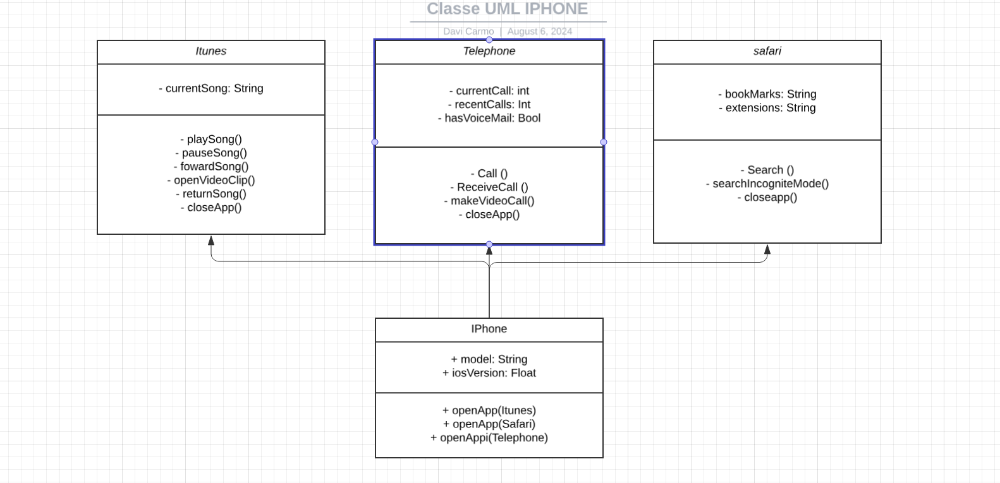

# IPhoneClassesDiagram
IPhone Classes Diagram

### Summary of the Class Diagram

This class diagram represents an abstraction of an iPhone's functionalities through three main components: **MusicPlayer**, **Telephone**, and **Browser**. These components are represented as superclasses, each with specific attributes and methods. Specialized subclasses—**iTunes**, **Dialer**, and **Safari**—inherit from these superclasses, adding more specific attributes related to their functionalities.

#### Classes

1. **iTunes** (inherits from `MusicPlayer`)
   - **Attributes**:
     - `currentSong`: The current song playing or selected.

   - **Methods**:
     - `playSong()`: Play a song.
     - `closeApp()`: Closes the current app.
     - `pauseSong()`: Pauses a current song
     - `fowardSong()`: Foward to the next song
     - `returnSong()`: return to the previous song.
     - `OpenVideoClip()`: open a music videoclip.

3. **Telephone** (inherits from `Telephone`)
   - **Attributes**:
     -  `currentCall`: The phone number of the current call.
     -  `recentCalls`: The most recent calls done or received.
     - `hasVoiceMail()`: Indicate if exist a voice Mail.
   - **Methods**:
     - `call()`: make a call.
     - `receiveCall()`: receive a call.
     - `makeVideoCall()`:  make a video call.
     - `closeApp()`: Closes the current app.
       
4. **Safari** (inherits from `Browser`)
   - **Attributes**:
     - `bookMarks`: the added favorite sites.
     - `extensions`: Installed extensions.
      
   - **Methods**:
     - `search()`: make a search in web.
     - `searchInIcogniteMode()`: search in incognite mode.
     - `closeApp()`: Closes the current app.
       
5. **Iphone Class**
  - **Attributes**:
    - `model`: Indicate the iphone model.
    - `iosVersion`: indicate the system version.

  - **Methods**:
    - `openApp(itunes)`: Open the app ITunes.
    - `openApp(telephone)`: Open the app Telephone.
    - `openApp(safari)`: Open the app Safari.

    
     
